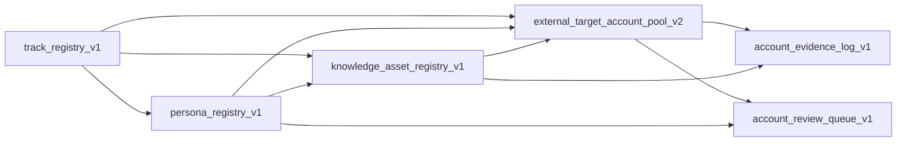

# 持续扩展高质量潜客池结构化主表模板总览 v1

## 1. 文档目的

本文件把 [持续扩展高质量潜客池的运营机制设计-v1.md](/Users/clairaipartner/.openclaw/workspace-main/bussiness-master/docs/04-研究与方法/持续扩展高质量潜客池的运营机制设计-v1.md) 进一步落成可执行载体，定义未来长期运行所需的 6 张核心结构化主表模板。

这 6 张表服务两个目标：

1. 把 `静态潜客池` 从批次文档升级为可持续维护的结构化主表
2. 把已学习的案例、解决方案、画像知识升级为可复用的 `知识资产层`

## 2. 当前推荐的 6 张核心表

1. `track_registry_v1`
2. `persona_registry_v1`
3. `knowledge_asset_registry_v1`
4. `external_target_account_pool_v2`
5. `account_evidence_log_v1`
6. `account_review_queue_v1`

说明：

- 这 6 张表覆盖当前最关键的长期运行对象。
- `AdmissionRecord` 和 `KnowledgeExtractionRecord` 仍然重要，但建议作为下一阶段补表，不阻塞当前先把主骨架跑起来。

## 3. 表之间的关系

## 4. 每张表的职责

### 4.1 `track_registry_v1`

作用：

- 管理当前启用主线
- 为未来新增行业提供统一入口
- 明确每条主线的优先级、成熟度、入池边界

### 4.2 `persona_registry_v1`

作用：

- 管理理想客户画像
- 支持画像版本化、停用、替换
- 作为账户入池和知识资产挂接的标准锚点

### 4.3 `knowledge_asset_registry_v1`

作用：

- 把案例、解决方案、场景包、行业洞察、销售叙事抽成可复用知识对象
- 供行业扩充、画像扩展、入池判断、上移核验、用户建议调用

### 4.4 `external_target_account_pool_v2`

作用：

- 作为未来唯一的静态潜客账户真相源
- 承载当前层级、主画像、主 JTBD、入池理由、知识连接和治理状态

### 4.5 `account_evidence_log_v1`

作用：

- 记录账户入池或上移的证据
- 保证“为什么进池 / 为什么上移”可追溯

### 4.6 `account_review_queue_v1`

作用：

- 支撑持续滚动运营
- 统一管理待入池、待核验、待上移、待清池、待知识抽取的工作项

## 5. 使用顺序建议

### Phase 1：先建注册层

优先落地：

1. `track_registry_v1`
2. `persona_registry_v1`
3. `knowledge_asset_registry_v1`

原因：

- 这三张表先稳定，后面的账户判断才不会漂

### Phase 2：再建账户层

随后落地：

4. `external_target_account_pool_v2`
5. `account_evidence_log_v1`
6. `account_review_queue_v1`

原因：

- 账户主表和证据、队列必须建立在主线、画像、知识资产都可引用的前提上

## 6. 与现有文档的关系

- 现有批次文档、核验文档、总池汇总视图，仍然是当前阶段的重要历史资产
- 但未来“最新事实口径”应逐步迁移到上述 6 张主表
- 文档应更多承担：
  - 规则说明
  - 月度复盘
  - 边界案例
  - 样例和解释

## 7. 关联模板文档

- [track_registry_v1-字段模板-v1.md](/Users/clairaipartner/.openclaw/workspace-main/bussiness-master/docs/02-注册表与结构/track_registry_v1-字段模板-v1.md)
- [persona_registry_v1-字段模板-v1.md](/Users/clairaipartner/.openclaw/workspace-main/bussiness-master/docs/02-注册表与结构/persona_registry_v1-字段模板-v1.md)
- [knowledge_asset_registry_v1-字段模板-v1.md](/Users/clairaipartner/.openclaw/workspace-main/bussiness-master/docs/02-注册表与结构/knowledge_asset_registry_v1-字段模板-v1.md)
- [external_target_account_pool_v2-字段模板-v1.md](/Users/clairaipartner/.openclaw/workspace-main/bussiness-master/docs/02-注册表与结构/external_target_account_pool_v2-字段模板-v1.md)
- [account_evidence_log_v1-字段模板-v1.md](/Users/clairaipartner/.openclaw/workspace-main/bussiness-master/docs/02-注册表与结构/account_evidence_log_v1-字段模板-v1.md)
- [account_review_queue_v1-字段模板-v1.md](/Users/clairaipartner/.openclaw/workspace-main/bussiness-master/docs/02-注册表与结构/account_review_queue_v1-字段模板-v1.md)
