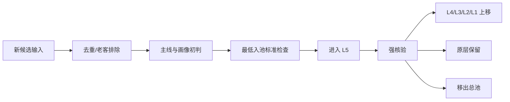
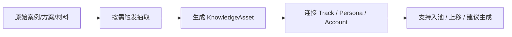

# 持续扩展高质量潜客池的运营机制设计 v1

## 1. 文档目的

本文件用于把当前已经形成的 `静态潜客池构建方法` 升级为一套可长期运行的机制。

目标不是继续手工滚动做一批批名单，而是建立一套 `扩池系统 + 知识资产系统`，支持未来持续完成：

- 新增潜客
- 去重与老客排除
- 画像归类
- 入池理由沉淀
- 公开证据核验
- 层级上移
- 新行业接入
- 新画像扩展
- 用户建议生成

本文件默认只处理 `静态潜客池` 与 `知识资产复用层`，不定义动态机会评分模型。

## 2. 设计目标

本机制需要同时解决两类长期问题：

1. `潜客池如何持续变大且不失真`
2. `已经学习过的大量客户案例、方案、画像知识，如何持续发挥作用`

## 3. 已锁定前提

- 采用 `双轨并行`
  - 主表承载账户、状态、证据
  - 文档承载规则、复盘、样例和研究沉淀
- 新增入口必须支持 `LLM 主动搜寻`
- 新账户默认 `先入 L5`
- 运行方式采用 `持续滚动`
- LLM 主负责 `找 + 核验`
- 目前仍以 `静态潜客池` 为主
- 动态机会判断是后续叠加层
- 案例 / 方案知识未来采用 `按需更新`
- 知识形态采用 `混合模式`
  - 保留原始材料
  - 抽结构化知识索引
  - 用于按需检索与复用

## 4. 核心结论

### 4.1 潜客池必须产品化为持续运营系统

未来不应继续停留在“研究驱动的批次文档流水线”，而应演进为一套稳定可运行的机制。

### 4.2 行业与画像必须是可扩展对象

当前三条主线不是常量，而是当前已启用主线。未来应支持新增行业和新增画像，而不推翻已有池子。

### 4.3 案例和方案必须升级成知识资产层

这些知识不能只停留在：

- 原始案例文档
- 人工记忆
- 某轮分析里临时引用

而应成为可持续调用的知识资产。

### 4.4 知识层未来要同时服务四类场景

- 行业扩充
- 画像扩展
- 账户入池与上移判断
- 给用户生成建议与解释

## 5. 总体分层设计

未来持续机制由三层组成：

### Layer A：静态潜客池系统

负责回答：

- 谁客观上像我们的理想客户

### Layer B：知识资产系统

负责回答：

- 为什么像
- 观远已有哪类样本、案例、方案、打法可以支撑

### Layer C：后续动态机会系统

负责回答：

- 谁现在更值得优先投入

说明：

- 本文件主要设计 `A + B`
- `C` 只做接口预留，不在本版内定义评分

## 6. 推荐的知识形态

推荐采用 `混合模式`。

### 6.1 原始材料层

包括：

- 客户案例
- 解决方案
- 内部项目材料
- 公开案例
- 映射文档

### 6.2 结构化知识层

把原始材料中稳定可复用的信息抽成结构化知识对象，用于：

- 规则匹配
- 入池解释
- 上移核验
- 行业扩展
- 用户建议生成

### 6.3 派生应用层

结构化知识层未来主要服务：

- 扩池
- 核验
- 画像扩展
- 用户建议生成

### 6.4 为什么不只做长文档库

因为未来如果持续扩行业、扩画像、扩公司，每次都让 LLM 重读长文档，会带来：

- 成本高
- 判断不一致
- 难以治理

### 6.5 为什么不只做扁平结构化表

因为很多案例和方案知识包含上下文、叙事和边界条件，不能完全靠扁平字段表达。

### 6.6 最终原则

- `保留原始文档`
- `抽结构化索引`
- `关键判断优先引用结构化知识`
- `需要深度解释时回到原始文档`

## 7. 对象模型

未来整个体系至少维护以下 8 类对象。

### 7.1 `TrackRegistry`

定义：
- 主线注册表

作用：
- 管理当前启用的行业主线
- 支持未来新增行业

关键字段：
- `track_id`
- `track_name`
- `status`
  - `active`
  - `draft`
  - `deprecated`
- `priority_level`
- `maturity_level`
- `description`
- `entry_criteria_summary`
- `non_fit_boundary_summary`

当前已启用主线：
- `零售消费`
- `跨境电商`
- `先进制造`

未来可新增主线：
- 医药医疗
- 金融
- 企业服务
- 物流供应链
- 能源等

### 7.2 `PersonaRegistry`

定义：
- 理想客户画像注册表

作用：
- 记录每个画像的定义、适用主线、边界、典型 JTBD、样本和案例

关键字段：
- `persona_id`
- `persona_version`
- `persona_name`
- `track_id`
- `status`
  - `active`
  - `draft`
  - `deprecated`
- `definition`
- `fit_criteria`
- `non_fit_boundary`
- `typical_jtbd`
- `reference_customers`
- `reference_cases`
- `reference_solutions`
- `replaced_by_persona_id`

要求：
- 画像必须版本化
- 不允许直接覆盖旧画像

### 7.3 `KnowledgeAsset`

定义：
- 一条可复用知识资产

作用：
- 把案例 / 方案 / 材料沉淀成标准化可调用对象

关键字段：
- `asset_id`
- `asset_type`
  - `customer_case`
  - `solution_playbook`
  - `scenario_pack`
  - `industry_insight`
  - `sales_narrative`
  - `mapping_fact`
- `title`
- `source_path_or_url`
- `source_origin`
  - `internal`
  - `external`
  - `public_web`
- `track_ids`
- `persona_ids`
- `customer_refs`
- `jtbd_tags`
- `complexity_tags`
- `summary`
- `key_signals`
- `confidence_level`
- `last_reviewed_at`

### 7.4 `Account`

定义：
- 一个公司级目标账户

作用：
- 静态潜客池主记录

关键字段：
- `account_id`
- `account_canonical_name`
- `brand_name`
- `group_name`
- `primary_track`
- `industry_l1`
- `industry_l2`
- `business_model`
- `persona_tag`
- `pool_layer`
- `static_priority`
- `admission_reason_summary`
- `primary_jtbd`
- `current_business_problem`
- `case_type_match`
- `existing_customer_reference`
- `solution_match`
- `knowledge_asset_refs`
- `dedupe_status`
- `legacy_customer_check_status`
- `review_status`
- `last_verified_at`

### 7.5 `Evidence`

定义：
- 支撑入池或上移的证据记录

作用：
- 解释为什么它能进池 / 上移

关键字段：
- `evidence_id`
- `account_id`
- `evidence_type`
- `source_locator`
- `evidence_strength`
- `supports_dimension`
- `summary`
- `checked_by`
- `checked_at`

### 7.6 `AdmissionRecord`

定义：
- 账户状态流转记录

作用：
- 记录从 `新候选 -> L5 -> L4/L3/L2/L1` 的历史

关键字段：
- `account_id`
- `action_type`
- `from_layer`
- `to_layer`
- `reason_summary`
- `evidence_refs`
- `performed_by`
- `performed_at`

### 7.7 `ReviewQueue`

定义：
- 待处理工作队列

作用：
- 支撑持续滚动运行

关键字段：
- `queue_item_id`
- `queue_type`
  - `new_intake`
  - `verification`
  - `promotion_review`
  - `boundary_review`
  - `knowledge_extraction`
  - `cleanup_review`
- `account_id`
- `priority`
- `owner`
- `status`

### 7.8 `KnowledgeExtractionRecord`

定义：
- 一次从案例 / 方案 / 材料中抽取知识的记录

作用：
- 保证未来新知识按需进入知识层

关键字段：
- `extraction_id`
- `source_path_or_url`
- `source_type`
- `extracted_assets`
- `persona_impacts`
- `track_impacts`
- `account_impacts`
- `performed_by`
- `performed_at`

## 8. 双轨并行设计

### 8.1 轨道 A：结构化主表体系

未来至少维护以下逻辑表：

1. `track_registry_v1`
2. `persona_registry_v1`
3. `external_target_account_pool_v2`
4. `account_evidence_log_v1`
5. `account_review_queue_v1`
6. `knowledge_asset_registry_v1`
7. `knowledge_extraction_log_v1`

主表职责：
- 承载账户真相
- 承载当前层级
- 承载可复核证据
- 承载与知识资产的连接

### 8.2 轨道 B：文档体系

未来文档主要承载四类内容：

#### 规则文档
- 主线定义
- 画像定义
- 入池规则
- 上移规则
- 清池规则

#### 版本文档
- 总池汇总视图
- 月度复盘
- 重点核验记录

#### 研究文档
- 行业扩展研究
- 新画像研究
- 边界案例分析

#### 样例文档
- 典型入池理由写法
- 典型证据写法
- 典型用户建议写法

约束：
- 文档不再承载唯一名单真相
- 主表是账户真相源
- 文档中的统计必须基于主表或主表导出口径

## 9. 新增行业与画像的扩展机制

### 9.1 新增行业接入流程

未来新增一个行业时，必须先走接入流程，而不是直接往池里塞公司。

步骤：
1. 在 `track_registry` 中新增 `draft` 主线
2. 定义该主线的：
   - 主线定义
   - 入池最低标准
   - 非适配边界
3. 先设计 `2-5` 个初始画像
4. 找 `3-10` 个标尺样本
5. 找 `3-10` 条初始知识资产
6. 明确该主线的典型 JTBD
7. 明确与现有主线的边界
8. 才允许开始建该行业的候选池

不允许的做法：
- 因为用户想要，就直接往现有池里塞一个新行业公司
- 先有公司，后补画像
- 先有名单，后补边界

### 9.2 画像扩展流程

未来新增画像时，必须先新增到 `persona_registry`，状态默认 `draft`。

画像从 `draft` 到 `active` 的条件：
1. 定义完整
2. 有清晰适配边界
3. 有清晰非适配边界
4. 有典型 JTBD
5. 有最少一组样本客户
6. 有最少一组案例或方案支撑

## 10. 知识资产系统设计

### 10.1 知识资产层目标

让未来已经学习过的大量案例和方案，在以下场景持续发挥作用：

1. 行业扩充
2. 画像扩展
3. 账户判断
4. 用户建议生成

### 10.2 知识资产最小结构

每条知识资产至少要能回答：
- 它属于哪条主线
- 它适用于哪些画像
- 它支撑哪些 JTBD
- 它支撑哪些复杂度判断
- 它能给用户什么建议
- 它的证据强度如何

### 10.3 知识资产调用节点

#### 节点 A：新增行业时调用
作用：
- 判断这个行业能不能接
- 这个行业最像哪些已知打法
- 现有案例能否外推

#### 节点 B：新增画像时调用
作用：
- 找相邻画像
- 找支持它的样本、方案、场景

#### 节点 C：账户入池时调用
作用：
- 判断它为什么符合画像
- 生成入池理由
- 找支撑案例和样本

#### 节点 D：账户上移时调用
作用：
- 判断证据是否足以上移
- 找更强标尺样本进行比对

#### 节点 E：给用户建议时调用
作用：
- 生成“为什么这个公司在池里”
- 生成“该怎么解释这个画像”
- 生成“观远已有哪个样本可以支撑”

## 11. 知识抽取与更新机制

### 11.1 维护策略

知识未来采用 `按需更新`，不做所有新材料强制全量入库。

### 11.2 触发按需更新的场景

以下场景触发知识抽取：
1. 需要新增行业
2. 需要新增画像
3. 需要给某类账户做强核验
4. 需要给用户输出建议，但现有知识引用不足
5. 需要修正某个画像边界
6. 新增材料明显改变已有认知

### 11.3 抽取流程

步骤：
1. 定位源材料
2. 判断材料属于哪类知识资产
3. 抽取结构化字段
4. 连接到：
   - track
   - persona
   - account
   - case
   - solution
5. 记录到 `knowledge_extraction_log`

### 11.4 抽取后必须沉淀的结果

每次抽取至少落一条：
- `KnowledgeAsset`

必要时同步更新：
- `persona_registry`
- `track_registry`
- `account_evidence_log`

## 12. 新增入口设计

未来新增入口统一支持 3 类，但走同一状态流。

### 12.1 用户单条补录

最小输入：
- 公司主体或品牌名
- 主线初判
- 一句话入池理由
- 来源说明

### 12.2 批量名单导入

最小输入：
- 公司列表
- 来源批次
- 主线候选范围

### 12.3 LLM 主动搜寻

最小输入：
- 搜索策略
- 目标主线
- 目标画像
- 初步入池理由
- 初步证据
- 待验证项

统一规则：
- 无论哪个入口，满足最低标准后都默认 `先入 L5`

## 13. 状态流设计

### 13.1 账户状态流

### 13.2 知识状态流

## 14. 最低入池标准

任何账户进入 `L5` 前，必须满足：

1. 主线成立
2. 画像成立
3. 一句话入池理由成立
4. 最小证据成立
5. 去重通过
6. 老客排除通过或进入待确认状态

允许的待确认：
- 主体和集团映射仍待补
- 经营复杂度颗粒度待补

不允许的缺失：
- 没有主线
- 没有画像
- 没有入池理由
- 没有任何证据

## 15. 强核验与上移规则

### 15.1 强核验优先顺序

1. 高静态优先级 `A`
2. 高标尺价值
3. 当前画像高质量样本不足
4. 现有知识资产支撑较强
5. 用户近期明确关注

### 15.2 上移规则

#### `L5 -> L4`
- 方向成立
- 最小证据扩充完成
- 但仍不足以成为补充样本

#### `L5/L4 -> L3`
- 证据较强
- 画像稳定
- 已可作为次级样本

#### `L4/L3 -> L2`
- 有强官方或年报级依据
- 可作为稳定扩池标尺

#### `L2 -> L1`
- 画像核心锚点
- 支撑最强
- 长期稳定可复用

## 16. 去重与老客排除

### 16.1 去重维度

- 公司主体
- 品牌名
- 集团名
- 历史 alias

### 16.2 去重触发点

- 新增前
- 导入前
- 上移前
- 月度清池前

### 16.3 老客排除触发点

- 新增前必查
- 上移前复查

### 16.4 边界处理

疑似老客但未确认：
- 进入 `boundary_review`
- 不直接进入正式 L5

## 17. 持续滚动运营机制

### 17.1 运行方式

采用 `持续滚动`

### 17.2 日常三条流并行

#### 流 1：新增流
- 用户补录或 LLM 搜寻
- 通过最低标准后入 `L5`

#### 流 2：核验流
- 从 `L5/L4` 中持续抽高价值账户
- 上移或保留

#### 流 3：知识流
- 需要扩行业 / 扩画像 / 补判断 / 给建议时
- 按需抽取知识资产

### 17.3 隐含节奏建议

#### 周节奏
- 新增
- 去重
- 初判
- 强核验
- 补知识资产

#### 月节奏
- 清池
- 复盘
- 更新总池汇总视图
- 画像健康检查
- 主线健康检查

## 18. 人机分工

### 18.1 LLM 主负责

1. 搜寻新账户
2. 去重
3. 老客明显排除
4. 主线 / 画像初判
5. 入池理由生成
6. 最小证据归集
7. 强核验草案
8. 上移建议
9. 新知识抽取草案
10. 用户建议草案

### 18.2 人主负责

1. 新行业接入决策
2. 新画像启用决策
3. 边界账户裁决
4. 规则修正
5. 月度治理复盘
6. 动态机会层设计决策

## 19. 对用户建议能力的设计

未来系统必须支持“给用户建议”，而不只是“给一张名单”。

### 19.1 账户解释
- 为什么这个公司在池子里
- 它属于哪个画像
- 依据是什么

### 19.2 行业扩展建议
- 哪个行业值得接入
- 为什么值得
- 需要哪些画像和样本

### 19.3 画像扩展建议
- 哪些新画像值得新增
- 为什么
- 哪些案例和样本支撑它

### 19.4 用户行动建议
- 当前最值得继续核验哪批账户
- 哪类账户最值得继续扩
- 哪些边界账户值得清理

生成依赖：
- `KnowledgeAsset`
- `PersonaRegistry`
- `Account`
- `Evidence`

禁止仅依赖即时自由发挥生成关键建议。

## 20. 接口与数据结构变更

### 20.1 新增逻辑表

- `track_registry_v1`
- `persona_registry_v1`
- `external_target_account_pool_v2`
- `account_evidence_log_v1`
- `account_review_queue_v1`
- `knowledge_asset_registry_v1`
- `knowledge_extraction_log_v1`

### 20.2 主表新增关键字段

- `knowledge_asset_refs`
- `dedupe_status`
- `legacy_customer_check_status`
- `review_status`
- `last_verified_at`

### 20.3 Track 字段新增

- `status`
- `priority_level`
- `maturity_level`

### 20.4 Persona 字段新增

- `persona_version`
- `status`
- `replaced_by_persona_id`

## 21. 失败模式与边界情况

### 21.1 新行业没有画像就开始入池
处理：
- 禁止
- 必须先走新行业接入流程

### 21.2 新画像没有样本就开始扩池
处理：
- 禁止进入 `active`
- 保持 `draft`

### 21.3 知识资产只留在长文档里
处理：
- 不视为可复用知识
- 需要按需抽取成结构化知识资产

### 21.4 文档与主表事实漂移
处理：
- 主表为真相源
- 汇总文档必须基于主表口径生成

### 21.5 LLM 只扩不核
处理：
- 机制上要求每轮滚动必须同时有新增和上移

## 22. 测试场景

### 行业扩展测试
- 新增一个行业时，是否能不破坏旧主线
- 是否能通过 `draft -> active` 流程启用新行业

### 画像扩展测试
- 新画像是否必须先有定义、样本、案例
- 是否支持画像版本替换

### 入池测试
- 单条新增能否进入 `L5`
- LLM 新增能否生成完整最小入池记录

### 知识抽取测试
- 新增案例时，能否抽成知识资产
- 知识资产能否连接到 persona / account / case

### 用户建议测试
- 是否能基于知识层生成行业扩展建议
- 是否能基于知识层生成账户解释
- 是否能基于知识层生成下一批核验建议

### 治理测试
- 重复账户能否被挡住
- 老客能否被排除
- 边界账户能否进入 review queue 而不污染正式池

## 23. 验收标准

当以下条件满足时，可视为该机制设计合格：

1. 未来新增行业有明确接入流程
2. 未来新增画像有明确版本化与启用流程
3. 新增账户有统一入口与统一状态流
4. 新增案例和方案能按需进入知识资产层
5. 知识资产能持续服务：
   - 行业扩充
   - 画像扩展
   - 入池判断
   - 上移核验
   - 用户建议
6. 主表、知识层、文档层职责清晰
7. 后续动态机会层可以在不推翻当前设计的前提下叠加

## 24. 默认假设与已选默认值

以下默认值在本方案中已锁定：

- 采用 `双轨并行`
- 新账户默认 `先入 L5`
- 运行方式采用 `持续滚动`
- LLM 主负责 `找 + 核验`
- 目前仍只做 `静态潜客池`
- 动态机会层后续叠加
- 知识形态采用 `混合模式`
  - 原始文档保留
  - 结构化知识索引抽取
- 知识维护采用 `按需更新`
- 知识未来同时服务：
  - 行业扩充
  - 画像扩展
  - 入池判断
  - 用户建议

## 25. 关联文档

- [外部目标客户池-v1.0-范围与边界说明.md](/Users/clairaipartner/Codex/bussiness-master/docs/archive/外部目标客户池-v1.0/外部目标客户池-v1.0-范围与边界说明.md)
- [外部目标客户池-v1.0-静态潜客池字段规范.md](/Users/clairaipartner/Codex/bussiness-master/docs/archive/外部目标客户池-v1.0/外部目标客户池-v1.0-静态潜客池字段规范.md)
- [外部目标客户池-v1.0-画像映射规则.md](/Users/clairaipartner/Codex/bussiness-master/docs/archive/外部目标客户池-v1.0/外部目标客户池-v1.0-画像映射规则.md)
- [外部目标客户池-v1.0-总池汇总视图-v0.7.md](/Users/clairaipartner/Codex/bussiness-master/docs/archive/外部目标客户池-v1.0/外部目标客户池-v1.0-总池汇总视图-v0.7.md)
- [内部客户案例系统学习-2026-03-28.md](/Users/clairaipartner/Codex/bussiness-master/docs/04-研究与方法/内部客户案例系统学习-2026-03-28.md)
- [客户案例与合作主体映射-v1.md](/Users/clairaipartner/Codex/bussiness-master/docs/04-研究与方法/客户案例与合作主体映射-v1.md)
- [持续扩展高质量潜客池-结构化主表模板总览-v1.md](/Users/clairaipartner/Codex/bussiness-master/docs/04-研究与方法/持续扩展高质量潜客池-结构化主表模板总览-v1.md)
- [track_registry_v1-字段模板-v1.md](/Users/clairaipartner/Codex/bussiness-master/docs/02-注册表与结构/track_registry_v1-字段模板-v1.md)
- [track_registry_v1-首版真实内容-v0.1.md](/Users/clairaipartner/Codex/bussiness-master/docs/02-注册表与结构/track_registry_v1-首版真实内容-v0.1.md)
- [persona_registry_v1-字段模板-v1.md](/Users/clairaipartner/Codex/bussiness-master/docs/02-注册表与结构/persona_registry_v1-字段模板-v1.md)
- [persona_registry_v1-首版真实内容-v0.1.md](/Users/clairaipartner/Codex/bussiness-master/docs/02-注册表与结构/persona_registry_v1-首版真实内容-v0.1.md)
- [knowledge_asset_registry_v1-字段模板-v1.md](/Users/clairaipartner/Codex/bussiness-master/docs/02-注册表与结构/knowledge_asset_registry_v1-字段模板-v1.md)
- [knowledge_asset_registry_v1-首版真实内容-v0.1.md](/Users/clairaipartner/Codex/bussiness-master/docs/02-注册表与结构/knowledge_asset_registry_v1-首版真实内容-v0.1.md)
- [external_target_account_pool_v2-字段模板-v1.md](/Users/clairaipartner/Codex/bussiness-master/docs/02-注册表与结构/external_target_account_pool_v2-字段模板-v1.md)
- [external_target_account_pool_v2-首版真实内容-v0.1.md](/Users/clairaipartner/Codex/bussiness-master/docs/archive/external_target_account_pool_v2/external_target_account_pool_v2-首版真实内容-v0.1.md)
- [account_evidence_log_v1-字段模板-v1.md](/Users/clairaipartner/Codex/bussiness-master/docs/02-注册表与结构/account_evidence_log_v1-字段模板-v1.md)
- [account_review_queue_v1-字段模板-v1.md](/Users/clairaipartner/Codex/bussiness-master/docs/02-注册表与结构/account_review_queue_v1-字段模板-v1.md)
